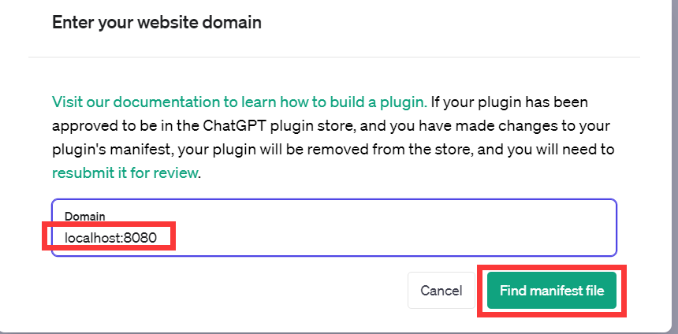
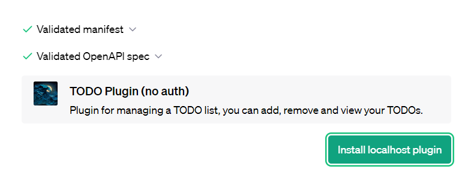
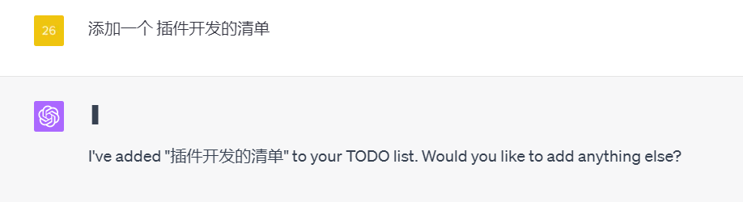
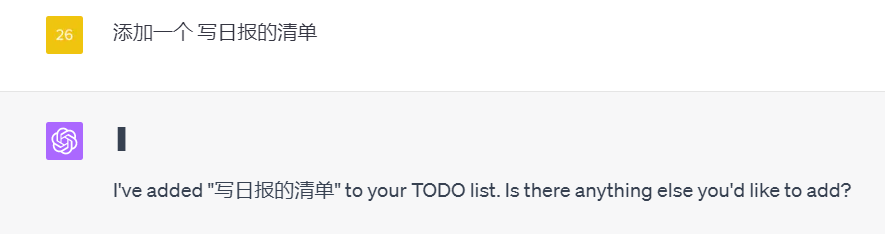
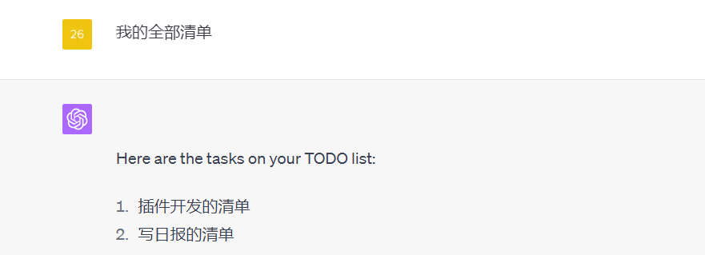

```bash
[chat-todo-plugin-java]
- java
- com
  - plugin
    - config
      - CorsConfig
    - controller
      - pluginsService
      - pluginsServiceImpl
- ChatTodoPluginJavaApplication
- resources
  - .well-known
    - ai-plugin.json
    - openapi.yaml
  - application.properties
```

### ai-plugin.json
#### 每个插件都需要一个ai-plugin.json文件，该文件需要托管在API的域中。
```json
{
    "schema_version": "v1",
    "name_for_human": "TODO Plugin (no auth)",
    "name_for_model": "todo",
    "description_for_human": "Plugin for managing a TODO list, you can add, remove and view your TODOs.",
    "description_for_model": "Plugin for managing a TODO list, you can add, remove and view your TODOs.",
    "auth": {
      "type": "none"
    },
    "api": {
      "type": "openapi",
      "url": "http://localhost:8080/openapi.yaml",
      "is_user_authenticated": false
    },
    "logo_url": "http://localhost:8080/logo.png",
    "contact_email": "legal@example.com",
    "legal_info_url": "http://example.com/legal"
}
```
### openapi.yaml
#### 用于记录API的OpenAPI规范。除了OpenAPI规范和清单文件中定义的内容外，ChatGPT中的模型对API一无所知。这意味着，如果您有一个扩展的API，则不需要向模型公开所有功能，并且可以选择特定的端点。
```yaml
openapi: 3.0.1
info:
  title: TODO Plugin
  description: A plugin that allows the user to create and manage a TODO list using ChatGPT. If you do not know the user's username, ask them first before making queries to the plugin. Otherwise, use the username "global".
  version: 'v1'
servers:
  - url: http://localhost:8080
paths:
  /todos/{username}:
    get:
      operationId: getTodos
      summary: Get the list of todos
      parameters:
      - in: path
        name: username
        schema:
            type: string
        required: true
        description: The name of the user.
      responses:
        "200":
          description: OK
          content:
            application/json:
              schema:
                $ref: '#/components/schemas/getTodosResponse'
    post:
      operationId: addTodo
      summary: Add a todo to the list
      parameters:
      - in: path
        name: username
        schema:
            type: string
        required: true
        description: The name of the user.
      requestBody:
        required: true
        content:
          application/json:
            schema:
              $ref: '#/components/schemas/addTodoRequest'
      responses:
        "200":
          description: OK
    delete:
      operationId: deleteTodo
      summary: Delete a todo from the list
      parameters:
      - in: path
        name: username
        schema:
            type: string
        required: true
        description: The name of the user.
      requestBody:
        required: true
        content:
          application/json:
            schema:
              $ref: '#/components/schemas/deleteTodoRequest'
      responses:
        "200":
          description: OK

components:
  schemas:
    getTodosResponse:
      type: object
      properties:
        todos:
          type: array
          items:
            type: string
          description: The list of todos.
    addTodoRequest:
      type: object
      required:
      - todo
      properties:
        todo:
          type: string
          description: The todo to add to the list.
          required: true
    deleteTodoRequest:
      type: object
      required:
      - todo_idx
      properties:
        todo_idx:
          type: integer
          description: The index of the todo to delete.
          required: true
```

### 保证接口可用 
```bash
curl -X GET http://localhost:8080/.well-known/ai-plugin.json 
```


### TODO Plugin (no auth)
```bash
# 获取openapi.yaml
curl http://localhost:8080/openapi.yaml

# 添加一个待办事项
curl -X POST -H "Content-Type: application/json" -d '{"todo":"Buy milk"}' http://localhost:8080/todos/username

# 获取一个用户的所有待办事项
curl http://localhost:8080/todos/username

# 删除一个待办事项
curl -X DELETE -H "Content-Type: application/json" -d '{"todoIdx":0}' http://localhost:8080/todos/username
```

### 调试

### 启动ChatTodoPluginJavaApplication
```
选择Develop your own plugin
```

```
填写本地地址
```

```
安装
```


```
使用
```




----------------
加我微信进行插件开发交流

